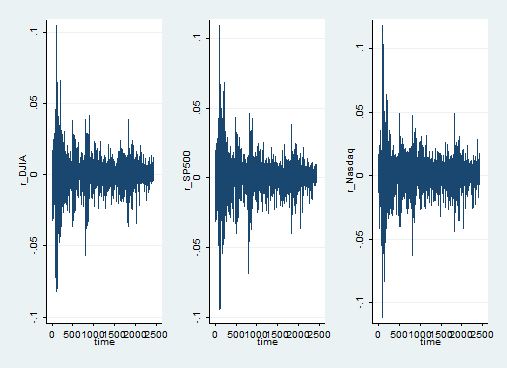

# StataExamples

In this teaching page we provide some useful examples for implementation in Stata depending on the application of interest. 

## [A]. Introduction to Econometrics 

We begin by considering a small simulation study for the parameter of a linear regression model below

$$ y_i = \beta x_i + e_i, \ \ \ \text{for} \ \ i = 1,...,n.$$

```Stata

set seed 1234
clear all

// We define a Stata program as below
program define mcexample, rclass
drop _all

set obs 50
gen e = rnormal(0,1)
gen x = rnormal(0,1)

gen y = beta*x + e
reg y x 

return scalar beta  = _b[x]
return scalar se = _se[x]

end
// end of Stata program

// Now we can run our Stata program using the build-in Stata function "simulate"
// Each sample is of size n = 50, while we repeat the above for B = 100 times

simulate beta=r(beta) se=r(se), reps(100): mcexample

```

## [B]. Applied Time Series Econometrics

In Applied Time Series Econometrics applications before fitting time series models to stock prices we need to estimate the corresponding stock returns which transform the data into stationary sequences in the convetional sence. To do this, we need to apply the rule below 

$$R_t = \frac{ P_{t+1} - P_t }{ P_t }, \ \ \ \text{for} \ t = 1,...,n,$$

where n is the sample size of the time series under examination. 



```Stata

// Time series time is set as the increasing number of observations
generate t=_n
tsset t

// Create the time series sequence for lag 1 
generate SP500_lag = l.SP500

// Create Actural Return time series
generate return_SP500 = ( SP500 - SP500_lag) / ( SP500_lag)

// Plot time return series
twoway (line return_SP500 t)

// Create first difference time series (1st Method)
 generate diff_SP500 = ( SP500 - SP500_lag)
 
 // Create first difference time series (2nd Method)
 generate dSP500=D.SP500
 
 // Create log-return time series
 generate log_returns = log( SP500 / SP500_lag )
 
 // Plots
twoway (line SP500 t), title (Time Series Plot - S&P500 Prices)
twoway (line return_SP500 t), title (Time Series Plot - Actual Returns of S&P500 Prices)

```

### Example: Arch and Garch modelling in Stata

```Stata

gen time=_n
tsset time

// generate log-return
foreach x in DJIA SP500 Nasdaq {
gen ln_`x'=log(`x')
gen r_`x'=D.ln_`x'
}

foreach x in r_DJIA r_SP500 r_Nasdaq {
qui tsline `x', name(`x', replace)
}

graph combine r_DJIA r_SP500 r_Nasdaq, cols(3) name(log_returns, replace)

// Fitting univariate GARCH models to time series observations

// GARCH(1,1)
foreach x in DJIA SP500 Nasdaq {
arch r_`x' L.r_`x', arch(1) garch(1)
}

// T-GARCH 
foreach x in DJIA SP500 Nasdaq {
arch r_`x' L.r_`x', arch(1) garch(1) tarch(1)
}

// GARCH-M
foreach x in DJIA SP500 Nasdaq {
arch r_`x' L.r_`x', archm arch(1) garch(1)
}

// Fitting multivariate GARCH models to time series observations

// Constant conditional correlation (CCC)
mgarch ccc (r_DJIA r_SP500 r_Nasdaq = L.r_DJIA L.r_SP500 L.r_Nasdaq), arch(1) garch(1) nolog vsquish

// Dynamic conditional correlation (DCC)
mgarch dcc (r_DJIA r_SP500 r_Nasdaq = L.r_DJIA L.r_SP500 L.r_Nasdaq), arch(1) garch(1) nolog vsquish

// Varying conditional correlation (VCC)
mgarch vcc (r_DJIA r_SP500 r_Nasdaq = L.r_DJIA L.r_SP500 L.r_Nasdaq), arch(1) garch(1) nolog vsquish

```

## [C]. Resampling Techniques
